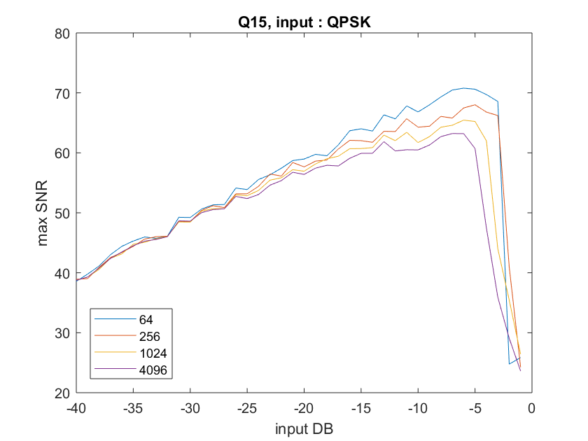
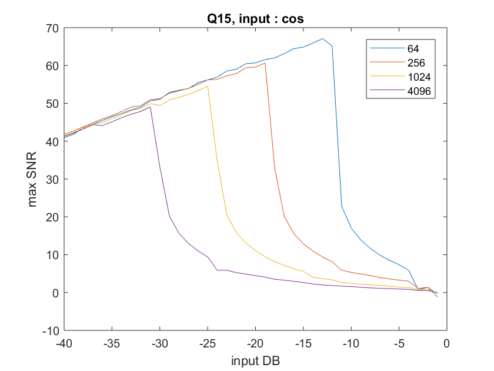
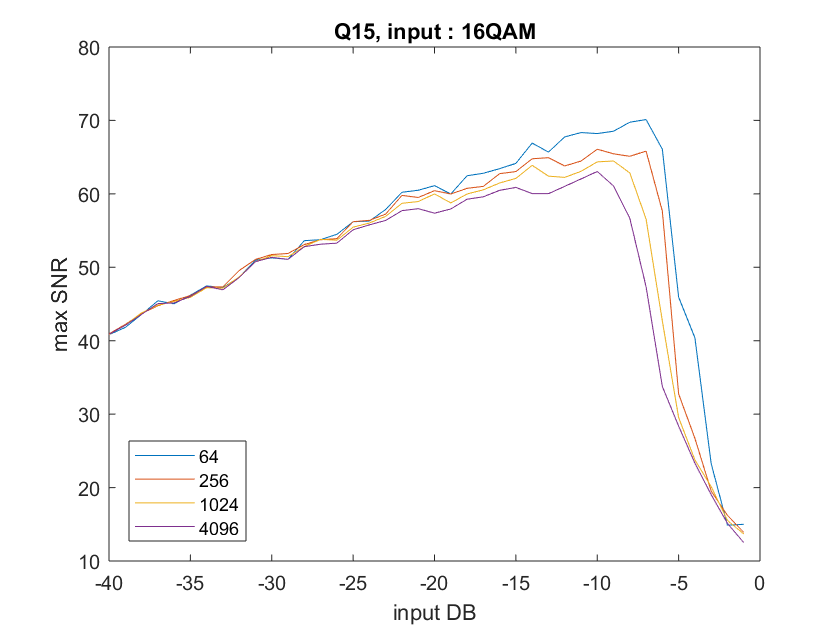
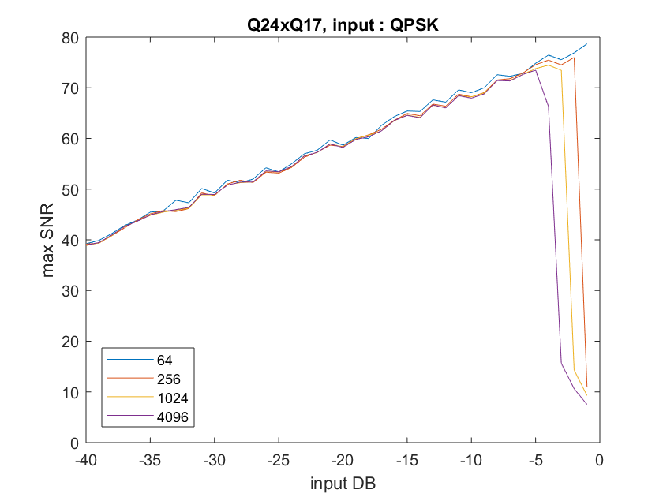
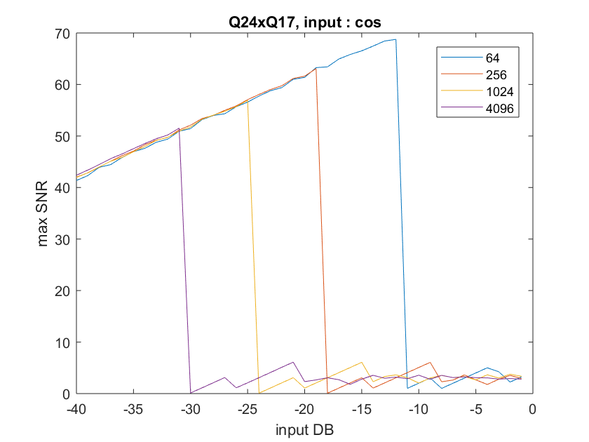
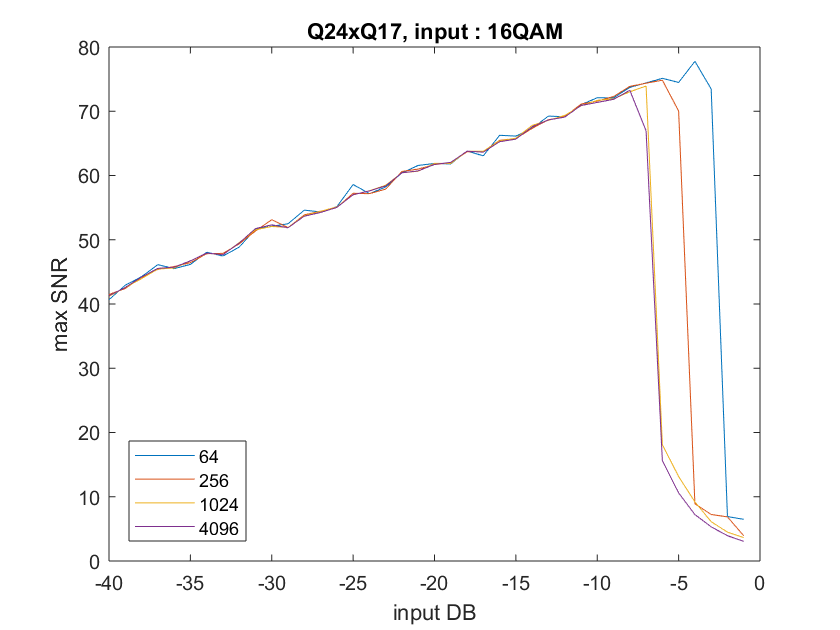

# Lab1


## Fixed-point arithmetic

### Q15


First, we need to define some saturation function to test our numbers when we compute an addition or a multiplication in order to be sure we stay in the right number range and avoid false values or errors.

Those saturation functions were already implemented in fixed_point for addition concerning Q15 and Q24xQ17 and the one for multiplication concerning Q24xQ17. We just had to add the one concerning Q15 on multiplication as follow:

We added a function on fixed-point.c
```c
int FIX_MPY(short x,short y){
	return ((short)(((int)x * (int)y)>>15));
}
```

We then need to call those saturation function in the right place in fft.
Every time an addition is performed and we are not sure the result will stay in the right range, we call the function. The following piece of code shows how we called the function. When to numbers can't go beyond a value which is known (by analysing the code), we don't need to call the function.
The following code is the implementation of the fft in Q15:

We modified fft.c on additions
```c
bfly[0].r = SAT_ADD16(SAT_ADD16(x[n2].r,x[N2 + n2].r),SAT_ADD16(x[2*N2 + n2].r,x[3*N2 + n2].r));
bfly[0].i = SAT_ADD16(SAT_ADD16(x[n2].i,x[N2 + n2].i),SAT_ADD16(x[2*N2 + n2].i,x[3*N2 + n2].i));
bfly[1].r = SAT_ADD16(SAT_ADD16(x[n2].r,x[N2 + n2].i),-SAT_ADD16(x[2*N2 + n2].r,x[3*N2 + n2].i));
bfly[1].i = SAT_ADD16(SAT_ADD16(x[n2].i,-x[N2 + n2].r),SAT_ADD16(-x[2*N2 + n2].i,x[3*N2 + n2].r));

bfly[2].r = SAT_ADD16(SAT_ADD16(x[n2].r,-x[N2 + n2].r),SAT_ADD16(x[2*N2 + n2].r,-x[3*N2 + n2].r));
bfly[2].i = SAT_ADD16(SAT_ADD16(x[n2].i,-x[N2 + n2].i),SAT_ADD16(x[2*N2 + n2].i,-x[3*N2 + n2].i));

bfly[3].r = SAT_ADD16(SAT_ADD16(x[n2].r,-x[N2 + n2].i),SAT_ADD16(-x[2*N2 + n2].r,x[3*N2 + n2].i));
bfly[3].i = SAT_ADD16(SAT_ADD16(x[n2].i,x[N2 + n2].r),-SAT_ADD16(x[2*N2 + n2].i,x[3*N2 + n2].r));
```

We also modified fft on multiplications thanks to the FIX_MPY routine:
```c
// In-place results
for (k1=0; k1<N1; k1++)
{
twiddle_fixed(&W, N, (double)k1*(double)n2);
x[n2 + N2*k1].r = SAT_ADD16(FIX_MPY(bfly[k1].r,W.r),FIX_MPY(-bfly[k1].i,W.i));
x[n2 + N2*k1].i = SAT_ADD16(FIX_MPY(bfly[k1].i,W.r),FIX_MPY(bfly[k1].r,W.i));

}

```


### Q24xQ17


The same method applies to Q24xQ17.

```c
bfly[0].r = SAT_ADD25(SAT_ADD25(x[n2].r,x[N2 + n2].r),SAT_ADD25(x[2*N2 + n2].r,x[3*N2 + n2].r));
bfly[0].i = SAT_ADD25(SAT_ADD25(x[n2].i,x[N2 + n2].i),SAT_ADD25(x[2*N2 + n2].i,x[3*N2 + n2].i));
bfly[1].r = SAT_ADD25(SAT_ADD25(x[n2].r,x[N2 + n2].i),-SAT_ADD25(x[2*N2 + n2].r,x[3*N2 + n2].i));
bfly[1].i = SAT_ADD25(SAT_ADD25(x[n2].i,-x[N2 + n2].r),SAT_ADD25(-x[2*N2 + n2].i,x[3*N2 + n2].r));

bfly[2].r = SAT_ADD25(SAT_ADD25(x[n2].r,-x[N2 + n2].r),SAT_ADD25(x[2*N2 + n2].r,-x[3*N2 + n2].r));
bfly[2].i = SAT_ADD25(SAT_ADD25(x[n2].i,-x[N2 + n2].i),SAT_ADD25(x[2*N2 + n2].i,-x[3*N2 + n2].i));

bfly[3].r = SAT_ADD25(SAT_ADD25(x[n2].r,-x[N2 + n2].i),SAT_ADD25(-x[2*N2 + n2].r,x[3*N2 + n2].i));
bfly[3].i = SAT_ADD25(SAT_ADD25(x[n2].i,x[N2 + n2].r),-SAT_ADD25(x[2*N2 + n2].i,x[3*N2 + n2].r));


// In-place results
for (k1=0; k1<N1; k1++)
{
twiddle_fixed_Q17(&W, N, (double)k1*(double)n2);
x[n2 + N2*k1].r = SAT_ADD25(FIX_MPY25by18(bfly[k1].r,W.r),-FIX_MPY25by18(bfly[k1].i,W.i));
x[n2 + N2*k1].i = SAT_ADD25(FIX_MPY25by18(bfly[k1].i,W.r),FIX_MPY25by18(bfly[k1].r,W.i));
}
```

## Twiddle factor


In the following piece of code which is the twiddle factor for Q17, we troncate (like a floor operation) the real and imaginary part of the number independently so that they represent fixed-point.

Another more efficient way to do it would be to test all combinations of real and imaginary part (ex: taking the floor of the real part and the ceiling of the imaginary part) and look at which one is closer from our original number.


```
void twiddle_fixed_Q17(struct complex32 *W, int N, double stuff)
{
  W->r=(int)(((1<<17)-1)*cos(stuff*2.0*PI/(double)N));
  W->i=(int)((1-(1<<17))*sin(stuff*2.0*PI/(double)N));
}
```


## Distortion test

We aim to compare fixed-point versus floating-point for the fft. The floating-point method allows to represent a wider scale of numbers. However, in some cases, using fixed-point can have a better performance. The idea is to plot the SNR depending on the input in DB. The SNR being the Signal to Noise Ratio, in which the Signal is the data resulting from floating-point processing and the Noise is the distortion (that is to say the difference because the floating-point result and the fixed-point one).
In order to have real randomness, we need to call two functions: randominit and set_taus_seed which generate random numbers starting from a different seed every time.


### Q15_QPSK




### Q15_cos



### Q15_16QAM




## Q24x17
We created another function fft2.c and modified the Makefile in order to obtain the results for Q24x17


We modified fft2.c on additions

```c
bfly[0].r = SAT_ADD25(SAT_ADD25(x[n2].r,x[N2 + n2].r),SAT_ADD25(x[2*N2 + n2].r,x[3*N2 + n2].r));
bfly[0].i = SAT_ADD25(SAT_ADD25(x[n2].i,x[N2 + n2].i),SAT_ADD25(x[2*N2 + n2].i,x[3*N2 + n2].i));
bfly[1].r = SAT_ADD25(SAT_ADD25(x[n2].r,x[N2 + n2].i),-SAT_ADD25(x[2*N2 + n2].r,x[3*N2 + n2].i));
bfly[1].i = SAT_ADD25(SAT_ADD25(x[n2].i,-x[N2 + n2].r),SAT_ADD25(-x[2*N2 + n2].i,x[3*N2 + n2].r));

bfly[2].r = SAT_ADD25(SAT_ADD25(x[n2].r,-x[N2 + n2].r),SAT_ADD25(x[2*N2 + n2].r,-x[3*N2 + n2].r));
bfly[2].i = SAT_ADD25(SAT_ADD25(x[n2].i,-x[N2 + n2].i),SAT_ADD25(x[2*N2 + n2].i,-x[3*N2 + n2].i));

bfly[3].r = SAT_ADD25(SAT_ADD25(x[n2].r,-x[N2 + n2].i),SAT_ADD25(-x[2*N2 + n2].r,x[3*N2 + n2].i));
bfly[3].i = SAT_ADD25(SAT_ADD25(x[n2].i,x[N2 + n2].r),-SAT_ADD25(x[2*N2 + n2].i,x[3*N2 + n2].r));
```
```c
for (k1=0; k1<N1; k1++)
{
twiddle_fixed_Q17(&W, N, (double)k1*(double)n2);
x[n2 + N2*k1].r = SAT_ADD25(FIX_MPY25by18(bfly[k1].r,W.r),-FIX_MPY25by18(bfly[k1].i,W.i));
x[n2 + N2*k1].i = SAT_ADD25(FIX_MPY25by18(bfly[k1].i,W.r),FIX_MPY25by18(bfly[k1].r,W.i));
}
```

We replaced the function radix4_fixed_Q15 and bit_r4_reorder_fixed_Q15
```c
// Do Q24 FFT
radix4_fixed_Q24xQ17(data32, N,scale,0);
bit_r4_reorder_fixed_Q17(data32, N);


// Compute Distortion statistics
mean_error = 0.0;
mean_in = 0.0;
for (i=0;i<N;i++) {
  mean_in += data[i].r*data[i].r + data[i].i*data[i].i;
  mean_error += pow((data[i].r-((double)data32[i].r/32767.0)),2) + pow((data[i].i-((double)data32[i].i/32767.0)),2);
}


```
### Q24xQ17_QPSK




### Q24x17_cos





### Q24x17QAM


