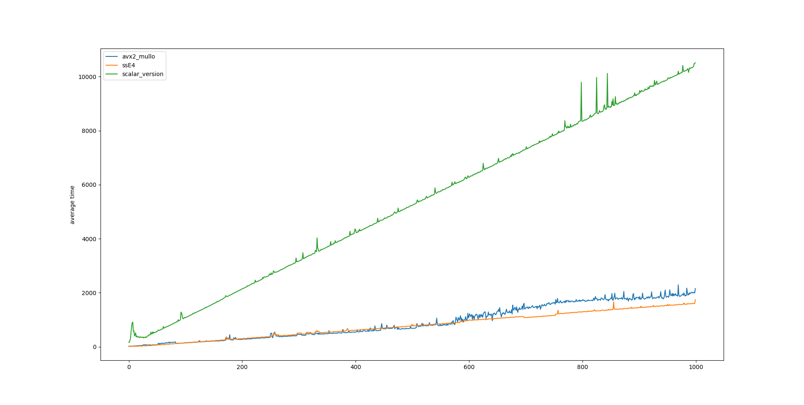
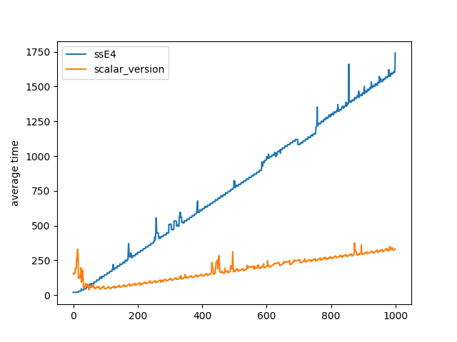

# LAB2


## Write the basic SIMD code for scalar version,  SSE4 (128-bit SIMD) and AVX2 (256-bit SIMD)


```c++

void componentwise_multiply_real_scalar(int16_t *x,int16_t *y,int16_t *z,uint16_t N) {
  for(int i=0; i<N; i++){
    z[i]=FIX_MPY(x[i],y[i]);
  }


}

// routines to be written
void componentwise_multiply_real_sse4(int16_t *x,int16_t *y,int16_t *z,uint16_t N) {

__m128i *x128 = (__m128i *)x;
__m128i *y128 = (__m128i *)y;
__m128i *z128 = (__m128i *)z;

for (int i=0; i<N; i++){
  z128[i] = _mm_mulhrs_epi16(x128[i], y128[i]);
}
}


void componentwise_multiply_real_avx2(int16_t *x,int16_t *y,int16_t *z,uint16_t N) {

__m256i *x256 = (__m256i *)x;
__m256i *y256 = (__m256i *)y;
__m256i *z256 = (__m256i *)z;
for (int i=0; i<N; i++){
  z256[i] = _mm256_mullo_epi16(x256[i], y256[i]);
}
}
```


## Timing the routines

```c++
int main() {

	int N = 1000;

  int16_t *x, *y, *z;
	x=aligned_alloc(32,(N + N*288) *sizeof(int16_t));
	y=aligned_alloc(32,(N + N*288) *sizeof(int16_t));
	z=aligned_alloc(32,(N + N*288) *sizeof(int16_t));
  generate_random(x, y, N);


  int16_t *u, *v, *w;
	u=aligned_alloc(32,(N + N*288) *sizeof(int16_t));
	v=aligned_alloc(32,(N + N*288) *sizeof(int16_t));
	w=aligned_alloc(32,(N + N*288) *sizeof(int16_t));
 generate_random(u, v, N);


  time_stats_t ts;


	FILE *file;
	file=fopen("scalar_version","w+");

 	 for (int i = 0; i<N; i++){
		reset_meas(&ts);
    		for (int j = 0; j<10000; j++){
      			start_meas(&ts);
      			componentwise_multiply_real_scalar(x,y,z,i);
      			stop_meas(&ts);
    		}

		fprintf(file, "%lld\n", ts.diff/10000);

  	}

	fclose(file);


        file=fopen("ssE4","w+");

	for (int i = 0; i<N; i++){
   	 	reset_meas(&ts);
    		for (int j = 0; j<10000; j++){
      			start_meas(&ts);
      			componentwise_multiply_real_sse4(x,y,z,i);
      			stop_meas(&ts);
    		}
		fprintf(file, "%lld\n", ts.diff/10000);
  	}

        fclose(file);


  	for (int i = 0; i<N; i++){
    		reset_meas(&ts);
    		for (int j = 0; j<10000; j++){
			start_meas(&ts);
      			componentwise_multiply_real_avx2(u,v,w,i);
      			stop_meas(&ts);
    		}
		file = fopen("test","a+");
        	fprintf(file, "%lld\n", ts.diff/10000);
		fclose(file);
		printf("%d\n", i);
  	}


	free(x);
	free(y);
	free(z);
	free(u);
	free(v);
	free(w);

  return(0);


}
```


## Graphs and optimizations





Here we implemented optimizations for ssE4 and avx2.
Those optimizations are in the Makefile, choosing -O3.
Indeed, we used the following command to figure out that there were a lot of unoptimized iterations.  :
```bash
objdump file -D | less
```
Then, we decided to unroll the loop:
``` c
void componentwise_multiply_real_sse4(int16_t *x,int16_t *y,int16_t *z,uint16_t N) {

__m128i *x128 = (__m128i *)x;
__m128i *y128 = (__m128i *)y;
__m128i *z128 = (__m128i *)z;
for (int i=0; i<N; i+=8){
  z128[i] = _mm_mulhrs_epi16(x128[i], y128[i]);
	z128[i+1] = _mm_mulhrs_epi16(x128[i], y128[i+1]);
	z128[i+2] = _mm_mulhrs_epi16(x128[i], y128[i+2]);
	z128[i+3] = _mm_mulhrs_epi16(x128[i], y128[i+3]);
	z128[i+4] = _mm_mulhrs_epi16(x128[i], y128[i+4]);
	z128[i+5] = _mm_mulhrs_epi16(x128[i], y128[i+5]);
	z128[i+6] = _mm_mulhrs_epi16(x128[i], y128[i+6]);
	z128[i+7] = _mm_mulhrs_epi16(x128[i], y128[i+7]);


}
}
```


We can also observe that ssE4's performance is better than avx2. This can be due to the processor of the computer we used or how the memory is allocated.  


WHen using -03 for scalar_version, we obtained the following graph :



We found out  that the compiler was "too smart" and got rid of the multiplications.
That is why we added some routines to force operations
Here is the one for scalar_version :

```c++

void scalar_print(int16_t *x, int16_t *y, int16_t *z, uint16_t N) {
//	printf("%d", N);
	FILE *counter;
	FILE *X;
	FILE *Y;
	counter=fopen("scalar_test", "a+");
	X=fopen("X", "a+");
	Y=fopen("Y", "a+");
 	for (int i=0;i<N;i++){
		fprintf(counter, "%hi\n", z[i]);
		 fprintf(Y, "%hi\n", y[i]);
		 fprintf(X, "%hi\n", x[i]);
	}
	fclose(counter);
	fclose(X);
	fclose(Y);

}
```
